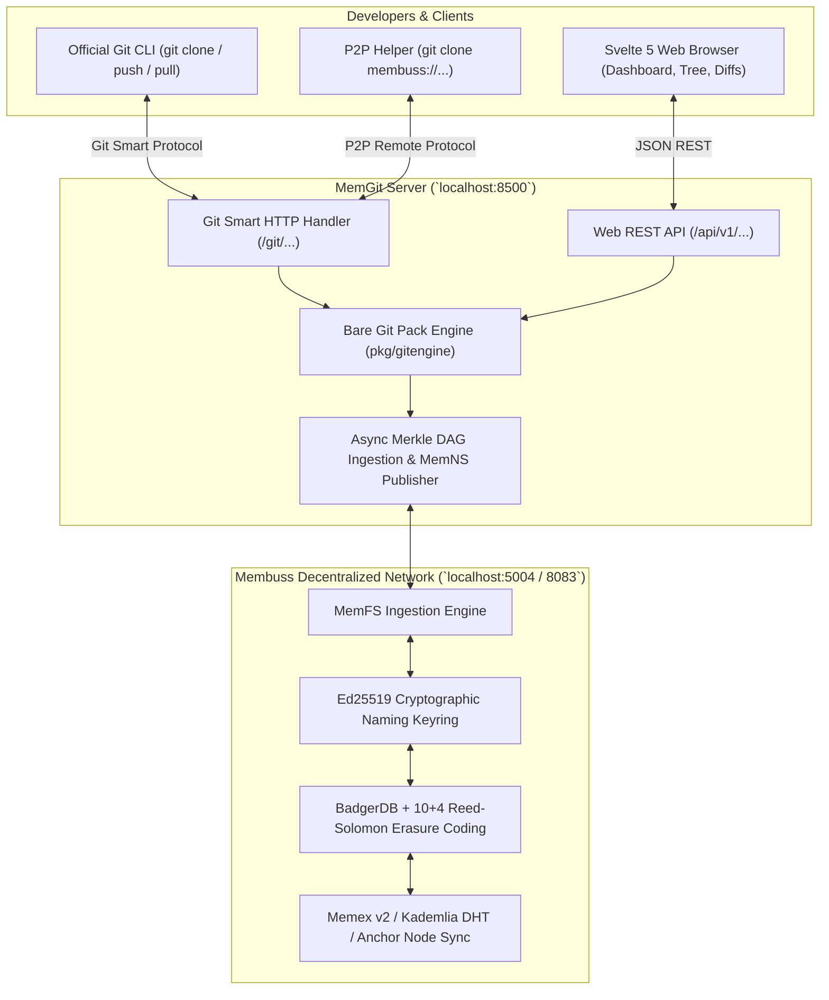

<div align="center">

# 🌌 MemGit

### Decentralized, Content-Addressed Git Platform & Remote Transport on Membuss

[](https://golang.org)
[](https://svelte.dev)
[](https://github.com/nnlgsakib/membuss)
[](https://libp2p.io)
[](LICENSE)

*Code collaboration without centralized servers. Every commit, branch, and release is erasure-coded (10+4), chunked into Merkle DAGs, and replicated autonomously across the Membuss P2P swarm and Anchor nodes.*

</div>

---

## 📑 Table of Contents
- [Overview & Architecture](#-overview--architecture)
- [Key Features](#-key-features)
- [Native Git CLI Compatibility](#-native-git-cli-compatibility)
- [Quickstart Guide](#-quickstart-guide)
- [Web Interface (Svelte 5)](#-web-interface-svelte-5)
- [CLI Command Reference](#-cli-command-reference)
- [P2P Remote Transport (`membuss://`)](#-p2p-remote-transport-membuss)
- [Configuration](#-configuration)
- [Documentation & Deep Dives](#-documentation--deep-dives)
- [Building from Source](#-building-from-source)

---

## 🏛️ Overview & Architecture

MemGit is a **standalone, decentralized Git hosting platform and remote transport engine**. It bridges standard Git tools (like the official `git` command line, IDEs, and GUI clients) with the **Membuss Content-Addressed P2P Storage Network**.



---

## ✨ Key Features

- **100% Native Git Compatibility**: Works out of the box with standard `git clone`, `git push`, `git pull`, `git fetch`, and `git remote add`.
- **Push-to-Create Autoprovisioning**: Push to any new repository URL and MemGit will automatically initialize the bare repository and provision an Ed25519 MemNS key on the fly.
- **Reed-Solomon (10+4) Erasure Coding**: Repositories survive up to 4 simultaneous node failures across the P2P swarm.
- **Cryptographic Ownership (MemNS)**: Repositories are anchored to Ed25519 public key identities (`/memns/<pubkey>`), giving authors immutable proof of ownership.
- **GitHub-Grade Collaboration**: Built-in decentralized Issues, Pull Requests, Code Review, Branch comparison, and Releases with snapshot MIDs (`mem1...`).
- **High-End Svelte 5 Web Explorer**: Deep obsidian dark theme (`ui-ux-pro-max`), line-numbered PrismJS syntax highlighting, Markdown README rendering, unified diff viewer, and real-time swarm radar.

---

## ⚡ Native Git CLI Compatibility

You don't need to change your daily Git workflow. Use the standard `git` CLI:

### 1. Push an Existing Local Repo to MemGit
```bash
cd my-project
git remote add origin http://localhost:8500/git/my-project.git
git branch -M main
git push -u origin main
```
*MemGit automatically initializes the repository on the fly, accepts the packfile, chunks the repository into a Merkle DAG, and signs the latest root MID to your MemNS key.*

### 2. Clone Any Repository
```bash
git clone http://localhost:8500/git/my-project.git
```

### 3. Native Git Subcommand (`git memgit`)
Add `memgit/bin` to your system `PATH` to use MemGit directly from the `git` command:
```bash
git memgit list
git memgit info my-project
git memgit sync my-project
```

---

## 🚀 Quickstart Guide

### 1. Start Membuss Node Daemon
Ensure your Membuss daemon is running (e.g. on ports `5004` / `8083`):
```bash
membuss daemon start
```

### 2. Start MemGit Server
```powershell
cd memgit
.\bin\memgit.exe serve -p 8500
```

### 3. Open Web Interface
Navigate to **`http://localhost:8500`** in your browser to explore repositories, inspect commit diffs, review pull requests, and view swarm health.

---

## 🖥️ Web Interface (Svelte 5)

MemGit includes a production-grade single-page application built in **Svelte 5**:

- **Repository Dashboard**: Filter repositories, view star counts, inspect cryptographic MemNS pointers, and monitor swarm peer connectivity.
- **Code Explorer**: Breadcrumb directory navigation, file size badges, and line-numbered PrismJS syntax highlighting (Go, JS/TS, Python, Rust, Markdown, YAML, Shell).
- **Commit History & Diffs**: Interactive timeline with copyable short SHAs, author metadata, and color-coded unified diff patches (`+additions` / `-deletions`).
- **Issues & Pull Requests**: Markdown discussion threads, label tagging, open/close workflows, and one-click PR merging.
- **Immutable Releases**: Draft tagged releases with permanent Merkle DAG root MIDs.
- **P2P Swarm Radar**: Real-time telemetry monitoring connected libp2p streams, DHT provider announcements, and 10+4 Reed-Solomon parity integrity.

---

## 💻 CLI Command Reference

The unified `memgit` executable offers full repository and network management:

```bash
# Server Management
memgit serve -p 8500                                 # Start server on port 8500
memgit serve --api-url http://127.0.0.1:5004         # Custom Node API endpoint

# Repository Lifecycle
memgit init <repo-name> -d "Description"             # Create decentralized repo
memgit list                                          # List all repositories
memgit info <repo-name>                              # Show metadata & swarm stats
memgit clone <url-or-name> [dir]                     # Clone repository
memgit sync <repo-name>                              # Force Merkle DAG snapshot to Membuss

# Git Objects & History
memgit log <repo-name> [ref] -n 20                   # View commit history
memgit branch <repo-name>                            # List branches
memgit branch <repo-name> create <branch> [sha]      # Create branch
memgit tag <repo-name> create <tag> -m "Release"     # Create tag & release snapshot

# Collaboration
memgit issue list <repo-name>                        # List open issues
memgit issue create <repo-name> -t "Title" -b "Body" # Create issue
memgit pr list <repo-name>                           # List pull requests
memgit pr merge <repo-name> <id>                     # Merge pull request

# Configuration
memgit config show                                   # Display active settings
memgit config set membuss_api http://127.0.0.1:5004  # Set Membuss API URL
memgit config set membuss_gateway http://127.0.0.1:8083 # Set Gateway URL
```

---

## 🌐 P2P Remote Transport (`membuss://`)

MemGit ships with a native Git remote transport helper binary: **`git-remote-membuss`**.

When installed in your `PATH`, standard Git can clone directly over the Membuss peer-to-peer network:

```bash
git clone membuss://memns1zdemo-p2p-app
```

---

## ⚙️ Configuration

MemGit reads settings with the following priority:
1. CLI Flags (`--api-url`, `--gw-url`, `--server`)
2. Environment Variables (`$MEMBUSS_API_URL`, `$MEMBUSS_GW_URL`, `$MEMGIT_SERVER_URL`)
3. Persistent Configuration File (`~/.memgit/config.json`)

```json
{
  "server_url": "http://localhost:8500",
  "membuss_api": "http://127.0.0.1:5004",
  "membuss_gateway": "http://127.0.0.1:8083",
  "data_dir": "./data",
  "web_dir": "./web/dist",
  "author_name": "Membuss Developer",
  "author_email": "dev@membuss.network"
}
```

---

## 📚 Documentation & Deep Dives

- [**Native Git Compatibility Guide**](docs/GIT_COMPATIBILITY.md) — Comprehensive guide on Smart HTTP, push-to-create, and Git CLI setup.
- [**System Architecture & P2P Protocols**](docs/ARCHITECTURE.md) — Merkle DAGs, Reed-Solomon erasure coding, and MemNS mechanics.
- [**REST API Reference**](docs/API_REFERENCE.md) — Complete endpoint documentation and request/response schemas.

---

## 🔨 Building from Source

### Prerequisites
- **Go**: 1.22 or newer
- **Node.js**: 18+ and `npm`
- **Git**: Official Git client

### Windows (PowerShell)
```powershell
.\build.ps1          # Full build (Svelte frontend + Go binaries + Tests)
.\build.ps1 -BinOnly # Recompile Go binaries only
.\build.ps1 -Clean   # Clean build artifacts
```

### Linux / macOS / WSL
```bash
make                 # Full build
make web             # Build Svelte frontend
make bin             # Compile Go binaries
make test            # Run unit & integration test suite
make clean           # Clean build artifacts
```

---

## 📜 License
MIT License. Built on the open [Membuss Network](https://github.com/nnlgsakib/membuss).
